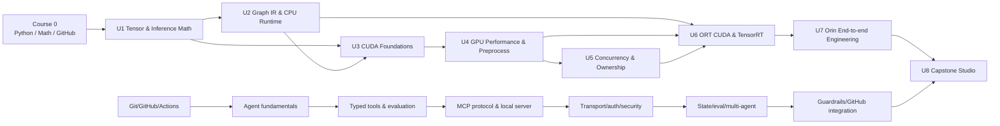

# AI Hardware Runtime + Agentic AI：课程总纲

## 课程定位

这是一门面向有系统工程经验、但没有系统 ML/AI 背景的 48 周项目制课程。主线目标是
把已有的 C/C++、Linux、DSP/异构计算和性能调试能力，迁移到：

```text
模型语义 → graph/runtime → CUDA execution → Orin 系统集成
```

副线目标是构建一个安全、可评估的 Runtime Lab Assistant，并以实际 artifact 覆盖
GH-600 的 agent architecture、tools/MCP、memory、evaluation、multi-agent 和
guardrails。副线是每日短任务，但仍有自己的先修关系，不是 48 个互不相干的话题。

本课程不是“看到 Week 48 就毕业”。**知识依赖、正确性和可复现证据决定是否解锁下一
单元。**

## 学制与工作量

- 48 个 content weeks：8 个 Unit × 6 周。
- 每周 6 天，每天 90–120 分钟，约 9–12 小时。
- 推荐一年排期：在 Week 12、24、36、48 后各加 1 个不引入新知识的 buffer week。
- 没有 ML 背景时，先按 [`START_HERE.md`](START_HERE.md) 完成 1–2 周 Course 0。

典型每周时间：

| 学习活动 | 每周 |
|---|---:|
| 主线理论与术语梳理 | 2–2.5 h |
| Worked examples / problem set | 1–1.25 h |
| Guided + independent lab | 3–3.5 h |
| 累计项目集成与证据 | 1–1.5 h |
| Agent/MCP/GH-600 副线 | 1.5–2 h |
| 复盘、口述与 Exit Ticket | 0.5–0.75 h |

## 课程依赖图



箭头表示硬依赖。比如，ORT/TensorRT 并不是“安装好就会用”：它依赖 U2 的模型与
correctness oracle、U4 的 GPU preprocessor、U5 的 stream/ownership 语义。缺少其中
任何一项，U6 的性能数字都可能正确性不明或被隐藏 copy 污染。

## 教学法：从知识到迁移，而不是从文档到复制

每周遵循相同梯度：

1. **Activate**：闭卷回忆先修概念，暴露误解。
2. **Learn**：按指定教材章节系统学习概念和术语。
3. **Work**：跟随 worked example 做手算、shape/address/timeline 推导。
4. **Guide**：完成有提示的最小实验，验证一个命题。
5. **Transfer**：在新输入或新约束下独立实现，不能照抄 reference。
6. **Integrate**：把本周结果加入同一个累计项目。
7. **Assess**：Exit Ticket；每 6 周进行一次 Major Gate。

周文件 [`weeks/`](weeks/) 是日常唯一入口，直接写出先修、链接、分钟、练习、项目增量
和解锁条件。Unit syllabus 用于看完整知识结构，不要求每天来回对应多个年度表。

## 教材层级

| 层级 | 作用 | 例子 |
|---|---|---|
| Primary teaching spine | 连续、系统地教概念 | D2L、PyTorch tutorials、PMPP、Microsoft Learn |
| Official reference | 核对 API、协议、版本保证 | CUDA/ORT/TensorRT/GitHub/MCP docs |
| Worked examples / labs | 将概念变成可观察行为 | 本仓库 problem、guided lab、CUDA samples |
| Enrichment seminar | 观察行业观点并练习批判性阅读 | podcast、blog、community talk |

Study Guide 是考试蓝图，不是教材；API reference 也不是从头到尾的课程。Podcast/blog
不能承担先修定义。完整有序资料见 [`docs/resources.md`](docs/resources.md)。

## 八个单元与累计项目

| Unit | Weeks | 主课程 | 主线 milestone | 副线 milestone | Major Gate |
|---|---:|---|---|---|---|
| U1 | 1–6 | Tensor、layout、MatMul、Conv、数值与 inference boundary | M1 CPU tensor/reference vertical slice | A1 GitHub control-plane dossier | G1 |
| U2 | 7–12 | Module/state、graph、ONNX、ORT CPU、measurement | M2 frozen contract + CPU inference pipeline | A2 typed failure-aware tool | G2 |
| U3 | 13–18 | GPU model、SIMT、memory、sync、errors、sanitizer | M3 CUDA tensor transforms | A3 MCP protocol traces/skeleton | G3 |
| U4 | 19–24 | Profiling、coalescing、Resize semantics/operator optimization | M4 optimized CUDA preprocessor + case study | A4 secured Runtime Lab Assistant v0 | G4 |
| U5 | 25–30 | streams、events、pinned memory、ownership、multi-frame | M5 async frame pipeline | A5 resumable state + eval dataset | G5 |
| U6 | 31–36 | ORT CUDA、I/O Binding、TensorRT、FP16、dynamic shape | M6 device-resident runtime backend | A6 multi-agent evidence reviewer | G6 |
| U7 | 37–42 | Orin integration、precision、power/thermal、reliability | M7 sustained Orin beta | A7 secured GitHub/evidence integration | G7 |
| U8 | 43–48 | optimization studio、CI、reproduction、portfolio、defense | M8 production release + 3 case studies | A8 Runtime Lab Assistant v1 + GH-600 evidence | G8 |

### Unit 1 — Tensor 与推理数学桥接

先修：入学诊断。核心问题是“逻辑 tensor 如何映射到物理 bytes，operator 如何改变
shape 与数据流”。依次学习 array/tensor metadata、stride/view/copy、MatMul、Conv、
activation/pooling/normalization/softmax、floating-point tolerance、training/eval/
inference boundary。

项目 M1：

```text
synthetic image
  → normalize
  → HWC→CHW
  → tiny PyTorch inference
  → intermediate tensor dump
```

Hard blockers：地址或 shape 推导错误；padded-stride/randomized CPU transform 不正确；
无法区分 operator/kernel、parameter/activation、training/inference。

### Unit 2 — Model lifecycle、Graph IR 与 CPU Runtime

先修：G1 PASS。学习 Module/state/checkpoint/eval、足够理解生命周期的 autograd、
computational graph、ONNX IR/opset/shape inference、ORT CPU provider/optimization、
tolerance、warm-up 和 latency distribution。

项目 M2 在此冻结最终 capstone 的 model、dataset、runtime input tensor、
normalize/layout 和 output contract，并形成 PyTorch → ONNX → ORT CPU clean pipeline。
Resize 的目标尺寸可以先记录，但 coordinate transform、pixel center、border、rounding
与 Resize tolerance 要在 U4 学完语义后由 M4 冻结。Hard blockers：export 或 clean run
不可复现；cross-backend output 超出 tolerance；cold/warm timing 混在一起。

### Unit 3 — CUDA Programming Foundations

先修：G1 tensor memory + G2 oracle/benchmark PASS。学习 host/device compilation、
grid/block/thread、warp/SIMT、memory hierarchy/coalescing、shared memory/sync、error
model、event timing、numerical non-associativity 和 Compute Sanitizer。

项目 M3 是一组 CUDA primitives 与 normalize/HWC→CHW transform；此阶段允许 D2H 与
CPU oracle 比较。Hard blockers：OOB、race、odd size 错误或异步错误不可观察。

### Unit 4 — GPU Performance 与 Preprocessing Operator

先修：G3 PASS。先学 memory/coalescing/shared memory，再讨论 occupancy；用 Nsight
Systems 定位阶段，用 Nsight Compute 检查单个 kernel。ONNX Resize schema 是坐标语义
来源，视觉上“差不多”不是 correctness。

项目 M4：独立 CPU oracle → naive CUDA → profiler-driven optimized CUDA →
resize/normalize/layout fusion，并完成第一份 case study。Hard blockers：边界语义不一致、
没有 raw samples、没有控制变量或只凭 profiler 截图下结论。

### Unit 5 — Concurrency、Ownership 与 Multi-frame Pipeline

先修：G4 正确的 preprocessor + G3 sync/error。学习 stream/event/default stream、
pinned transfer、overlap 条件、RAII、buffer lifetime、frame-slot state machine、
double buffering、latency vs throughput。CUDA Graphs 仅在 launch overhead 有证据且
workload 固定时选修。

项目 M5 连续处理 500–1000 frames。Hard blockers：隐式全局同步掩盖依赖；buffer
lifetime/shutdown 不可靠；timeline 不能支持 overlap 结论。

### Unit 6 — Inference Runtime 与 Device Integration

先修：G2 model、G4 preprocessor、G5 stream/ownership 全部 PASS。学习 ORT provider
partition/fallback/profiling/I/O Binding/user stream；TensorRT builder/network/
engine/context、`trtexec`、serialization、device buffers、`enqueueV3`、FP16 和 dynamic
profile。

项目 M6 通过 `RuntimeBackend` 对比 ORT CUDA 与 TensorRT，并让 CUDA preprocessor
输出直接进入 runtime。Hard blockers：silent fallback、hidden host round-trip、
engine/context/buffer lifetime 错误、FP16/dynamic 比较不公平。

### Unit 7 — Orin End-to-end Systems Engineering

先修：G6 device-resident vertical slice PASS。学习 end-to-end bottleneck reasoning、
allocator/copy/sync、Orin DVFS/power/thermal、`tegrastats`、sustained benchmark、
failure injection 和 rollback。量化先掌握 scale/zero-point/saturation/per-channel/
accumulator/calibration/Q/DQ；完整 INT8 为 elective。

项目 M7：Orin pipeline beta + BenchmarkRecorder + Runtime Lab Assistant 的 read-only
`list/validate/compare runs`。Hard blockers：缺少固定 power/thermal 条件、未解释 copy/
sync、stress/failure/rollback 不成立或 MCP 存在路径/schema/injection 漏洞。

### Unit 8 — Capstone Studio

先修：G1–G7 全部 PASS。原则上不再引入大型新技术；重点是 controlled optimization、
reproducibility、CI/release、technical writing、system-design review、security/eval
和 GH-600 synthesis。

项目 M8：

```text
Orin inference pipeline
  + benchmark artifact store
  + Runtime Lab Assistant v1
  + CI / release / threat model / eval evidence
  + 3 case studies
```

最终必须由 clean checkout/另一环境复现，做 10 分钟 defense 和随机追问。GH-600
readiness 与 Runtime graduation 分开评分，避免认证弱项掩盖或阻塞主线能力判断。

## Assessment 与解锁

每周有形成性 Exit Ticket；Week 6、12、18、24、30、36、42、48 是 Major Gate：

| 项目 | 权重 |
|---|---:|
| Closed-book knowledge exam，使用新题 | 25% |
| Unseen practical / debugging task | 30% |
| Cumulative project milestone | 30% |
| Oral/design defense | 15% |

总分至少 80，且 correctness、security、reproducibility 等 hard blockers 必须全部通过。
规则、重修和证据格式见 [`docs/mastery-gates.md`](docs/mastery-gates.md)。

## 两条项目线如何汇合

Runtime Lab Assistant 不是随意调用设备的“AI shell”。它只能读取受控 benchmark artifacts：

```text
Orin runtime
  → versioned benchmark/evidence bundle
  → fixed-schema artifact store
  → read-only MCP resources/tools
  → validate / compare / explain
  → human-approved engineering decision
```

这样副线会迫使主线生成结构化、可追溯证据；主线又为 MCP、eval、memory、multi-agent
和 guardrails 提供真实问题，而不是玩具 chat demo。

## 学术诚信与 reference solution

本仓库可能包含参考实现。所有 summative practical 必须在独立 starter file、个人
namespace 或 instructor-provided unseen variant 完成。`src/cpu/resize_cpu.cpp` 与
`src/cuda/resize_cuda.cu` 在 G4 前视为封存参考答案；不得把阅读或轻微改名后的代码当作
项目实现。具体规则见 [`docs/mastery-gates.md`](docs/mastery-gates.md)。

## 毕业标准

- G1–G8 全部 PASS，所有 hard blockers 关闭；
- Orin pipeline correctness、performance、power/thermal、reliability 可追溯；
- 三份 case study 可从 raw data 复核；
- Runtime Lab Assistant v1 通过 schema、auth/security、eval 和 audit tests；
- 能解释一次优化成功、一次错误假设和一次跨层 runtime 取舍；
- 另一位工程师能按 README 在 clean environment 复现代表性结果；
- GH-600 六域都有 artifact；是否预约考试由独立 readiness report 决定。
