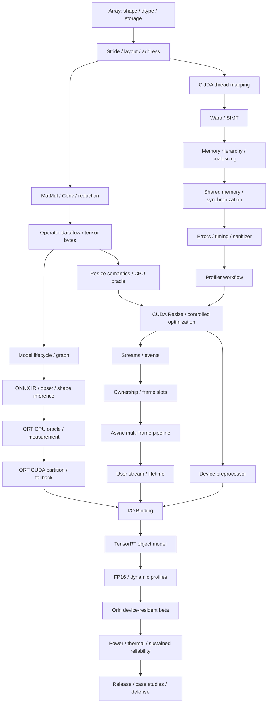

# AI Hardware Runtime 概念与先修地图

## 主线知识 DAG



如果一个节点解释不清，沿箭头向上查真正缺失的 prerequisite，不要直接搜当前高级
术语的“速成教程”。

## 从已有系统经验迁移

| Runtime 概念 | 可借用的经验 | 必须纠正的差异 |
|---|---|---|
| Tensor storage/stride | pitched buffer / image plane | shape 不足以确定地址；view 可不移动 bytes |
| Operator | DSP graph node / algorithm stage | operator 不一定一一对应 kernel |
| Graph optimizer/fusion | compiler pass / stage fusion | graph、provider、precision 和 shape 都影响实际执行 |
| CUDA launch | 向 accelerator queue 提交 command | launch 通常异步，创建大量逻辑 threads |
| Grid/block/thread | workgroup / worker | block 是共享资源与调度单元，thread 不是 CPU thread |
| Warp/SIMT | SIMD lane group | lanes 共享 instruction issue，divergence 会序列化路径 |
| SM | compute cluster | block 完整驻留一个 SM；资源限制 resident work |
| Global memory | device/system DRAM | warp address pattern 决定 transactions |
| Shared memory | software-managed scratchpad | block scope、容量有限、显式 sync、bank conflicts |
| Register | per-thread local fast storage | pressure 可降低 resident warps/blocks |
| Stream | command queue | 不是 CPU thread；并发需要无依赖且硬件可重叠 |
| Event | device queue fence/timestamp | 不等于普通 mutex；record/wait 的 stream 位置很重要 |
| Pinned memory | DMA-capable host buffer | 有系统成本；Orin shared DRAM 也不能忽略 API/cache 语义 |
| Execution Provider | backend partitioner | unsupported nodes 可 silent fallback 并产生 copies |
| TensorRT engine | versioned execution plan | 与 runtime/context 分离，受硬件/版本/shape/precision 约束 |
| Execution context | per-execution state | tensor addresses、shapes、stream、并发有 lifetime contract |
| MCP tool | typed capability/RPC | tool output 仍是不可信输入，schema 不等于 authorization |
| Agent memory | durable state/artifact | 模型 context 不是可靠持久状态，需要 identity/TTL/provenance |

## 五条贯穿课程的因果链

### 语义链

```text
model intent → operator contract → tensor shape/layout → correctness oracle → tolerance
```

### 执行链

```text
ONNX graph → provider/engine plan → kernels → grids/blocks/warps → instructions
```

### 数据链

```text
input storage → copy/allocator → device buffer → intermediate → output/evidence
```

### 时序链

```text
host enqueue → stream ordering → event dependency → completion/error observation
```

### 证据链

```text
commit + environment + workload → raw samples/trace → interpretation → scoped claim
```

每次学习或 debug 都问：

1. 正确语义由谁定义？
2. bytes 现在在哪里，谁拥有？
3. work 由谁调度，实际在哪个 backend/kernel 执行？
4. 完成与错误如何被观察？
5. 结论能否从 raw evidence 和版本复核？

## Agent/MCP 副线 DAG

```mermaid
flowchart LR
    GH["GitHub Flow"] --> ACT["Actions / SDLC / permissions"]
    ACT --> AG["Agent lifecycle / control plane"]
    AG --> TOOL["Typed tools / failure handling"]
    TOOL --> MCP["MCP JSON-RPC / lifecycle / capabilities"]
    MCP --> SRV["Local read-only server"]
    SRV --> NET["HTTP / auth / security"]
    NET --> STATE["Durable state / TTL / drift"]
    STATE --> EVAL["Eval / traces / tuning"]
    EVAL --> MA["Multi-agent isolation / handoff"]
    MA --> GUARD["HITL / audit / red-team"]
    GUARD --> PROD["GitHub MCP / CI / release"]
    PROD --> GH600["GH-600 evidence / defense"]
```



