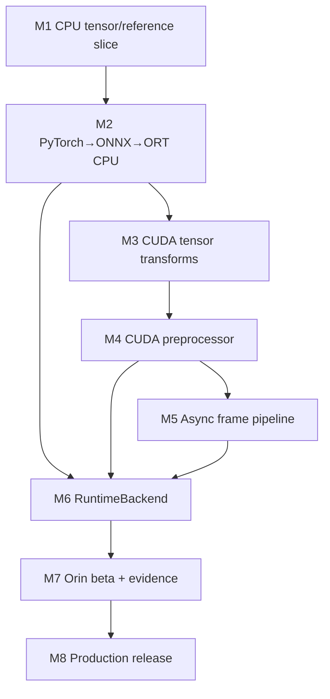

# Orin Runtime + Runtime Lab Assistant 累计项目路线

本项目从 Week 1 开始累计，每个 Unit 只增加建立在前一 Gate 之上的复杂度。最终产品
规格见 [`../course/project/spec.md`](../course/project/spec.md)，详细依赖见
[`../course/project/milestones.md`](../course/project/milestones.md)。

## 最终系统

```text
versioned input
  → CUDA resize + normalize + layout conversion
  → device tensor
  → ORT CUDA or TensorRT
  → comparator / postprocess
  → versioned evidence bundle
  → read-only Runtime Lab Assistant
       list_runs / validate_run / compare_runs
```

## 八级项目梯度

| Stage | Weeks | 增加的复杂度 | 必须先掌握 | Exit evidence |
|---|---:|---|---|---|
| M1 | 1–6 | CPU normalize/layout + tiny model | tensor address、MatMul/Conv、tolerance | CPU vertical slice |
| M2 | 7–12 | graph export + ORT CPU + measurement | model lifecycle、ONNX IR、oracle | frozen model/runtime-input + clean CPU pipeline |
| M3 | 13–18 | CUDA tensor transforms | GPU execution/memory/sync/errors | sanitizer-clean CUDA primitives |
| M4 | 19–24 | CUDA Resize + profiler optimization | Resize semantics、profiling、A/B | preprocessor case study |
| M5 | 25–30 | multi-frame concurrency | streams/events/ownership/lifetime | stress-tested async pipeline |
| M6 | 31–36 | ORT CUDA/TRT device integration | provider/fallback、TRT object model | device-resident RuntimeBackend |
| M7 | 37–42 | Orin sustained system + evidence service | power/thermal/reliability/security | Orin beta + compare-runs assistant |
| M8 | 43–48 | production/release/portfolio | CI、reproduction、failure injection | release + 3 reports + defense |

阶段间不是软建议。对应 G1–G8 未通过时，下一阶段的结果不具备可信前提。

## 主线 Project dependency



## Sidecar Project dependency

| Milestone | Week | Runtime Lab Assistant |
|---|---:|---|
| A1 | 6 | GitHub control plane、trust boundary、read-only reviewer |
| A2 | 12 | typed tool schema、failure/retry/rollback/eval baseline |
| A3 | 18 | MCP lifecycle/capability traces + stdio skeleton |
| A4 | 24 | read-only server v0、Inspector、HTTP/auth/security tests |
| A5 | 30 | durable state、TTL/reset/resume、versioned eval dataset |
| A6 | 36 | evidence reviewer + isolated multi-agent fixture |
| A7 | 42 | `list/validate/compare runs`、GitHub/CI、red-team |
| A8 | 48 | v1 release、threat model、audit、GH-600 evidence |

Runtime Lab Assistant 永远先消费静态、versioned artifacts。可选的 benchmark execution
tool 只有在 Core 全部稳定、allowlisted binary/cases、timeout/resource limit、audit 和
explicit approval 都存在后才讨论；它不是毕业必需项。

## 三份必交 Case Study

### 1. CUDA Preprocessor

- tensor/image/Resize semantic contract；
- independent CPU/CUDA randomized correctness；
- single-pixel、odd、padded stride、border；
- hypothesis、controlled A/B、Nsight Systems/Compute；
- kernel-only 与 end-to-end；
- fusion 适用条件和失败假设。

### 2. Async Pipeline

- buffer ownership/state machine；
- synchronous/single-stream/multi-stream 对照；
- pageable/pinned/Orin memory；
- event DAG 和 Nsight Systems timeline；
- first-frame latency、steady latency、throughput；
- 500–1000 frames、shutdown/error/lifetime。

### 3. Runtime Integration

- model/ONNX/backend/version；
- ORT partition/fallback/I/O Binding；
- TensorRT engine/context/buffer lifecycle；
- FP32/FP16、fixed/dynamic；
- hidden copy/sync/layout conversion；
- Orin power/clock/thermal/sustained data。

## Core 与 Elective

Core：

- one float Resize semantic；
- normalize/layout conversion；
- CUDA memory/streams/events；
- Nsight Systems/Compute；
- ORT CUDA I/O Binding；
- TensorRT C++、FP32/FP16、one dynamic profile；
- Orin sustained pipeline；
- read-only evidence MCP server。

Elective，只有当前 Gate 已 PASS 才做：

- affine/perspective warp；
- texture/vectorized variants；
- CUDA Graphs；
- INT8 calibration、DLA、TensorRT plugin；
- camera/DeepStream；
- agent-triggered benchmark；
- multiple models/runtimes。

## Reference solution quarantine

`src/cpu/resize_cpu.cpp` 与 `src/cuda/resize_cuda.cu` 已含参考实现。M4 学习项目必须在
独立 starter namespace/branch 完成，G4 前不读 reference。否则最重要的 unseen
practical 失去效度。规则见 [`mastery-gates.md`](mastery-gates.md)。
